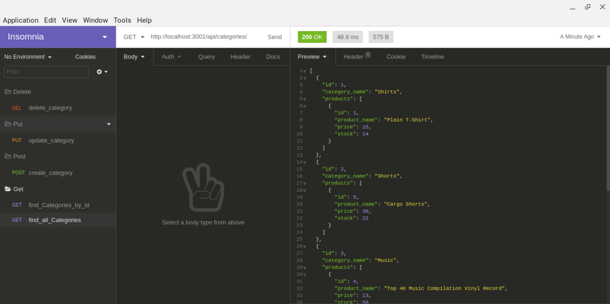
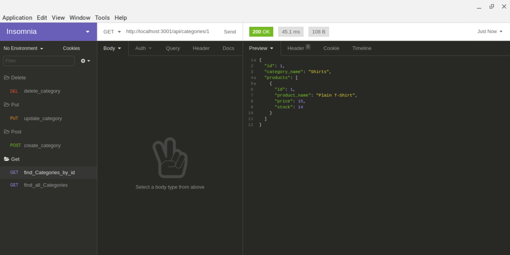
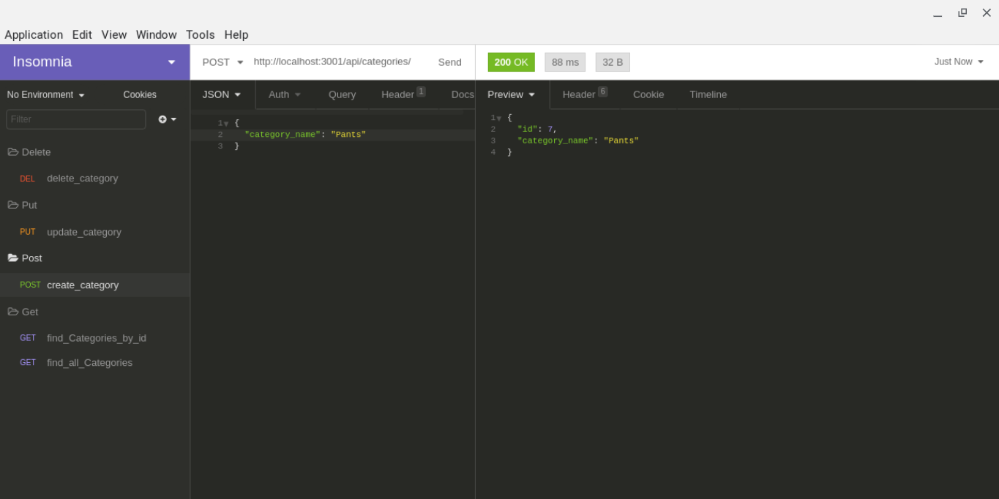
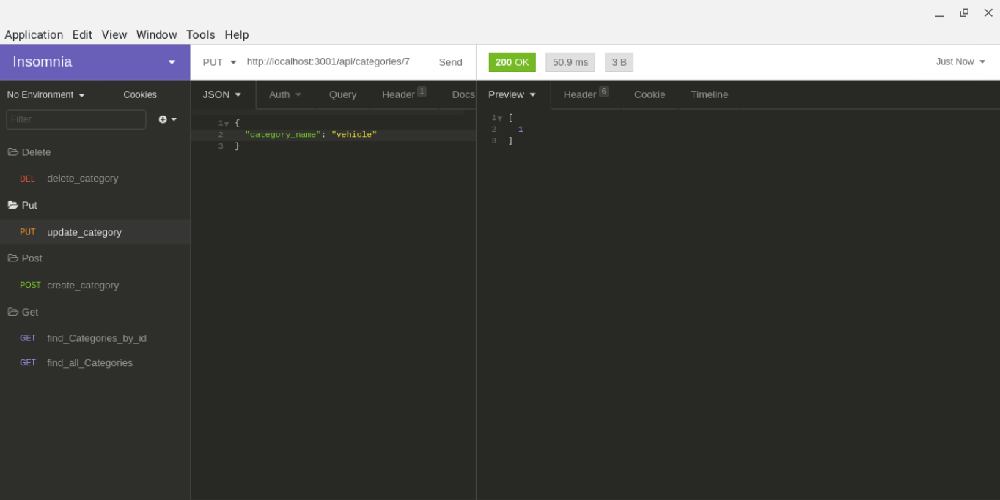
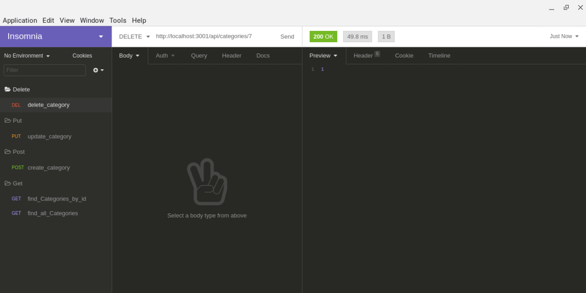

# Ecomerce Backend

## Operation:
https://drive.google.com/file/d/1wTMYYtfsQO1XulHq5-mTXyuAI_o2dug1/view

This a backend e-commerce program that uses express and sequelize to create a fully functionaly database with APIs to corresponding database tables to see, create, update or delete data.

GIVEN a functional Express.js API

WHEN I add my database name, MySQL username, and MySQL password to an environment variable file

THEN I am able to connect to a database using Sequelize

WHEN I enter schema and seed commands

THEN a development database is created and is seeded with test data

WHEN I enter the command to invoke the application

THEN my server is started and the Sequelize models are synced to the MySQL database

WHEN I open API GET routes in Insomnia Core for categories, products, or tags

THEN the data for each of these routes is displayed in a formatted 

WHEN I test API POST, PUT, and DELETE routes in Insomnia Core

THEN I am able to successfully create, update, and delete data in my database

